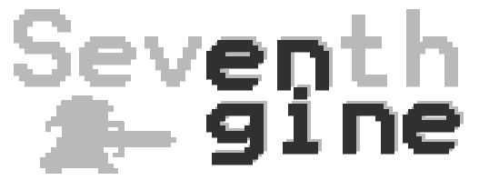

SeventhEngine
=============

Game engine, based in OpenGL

Libraries used
--------------

- OpenGL (graphics rendering)
- GLFW (windows management and input)
. DevIL (image loading)

Compiling
---------

### Windows

Visual Studio 2013 is recommended, though not required. There is currently no VS2010-2012 projects, only VS2013.

### Mac OS X

You need to install glfw and DevIL libraries:

`
brew install glfw3 devil
`
